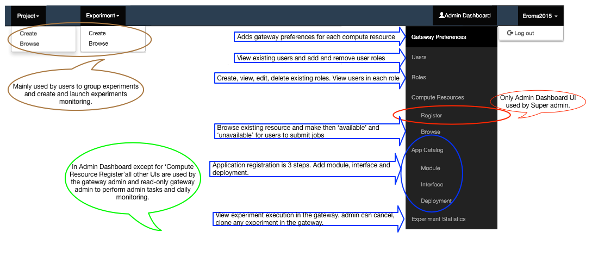

# Airavata Components
Super admin and Gateway admin can use gateway to register components, applications, preferences, etc...
For this first lets look at gateway UI components and which to use for each task in hand.

### Gateway Menu and Sub Menus
Image - Gateway Menu and Sub Menus

# Airavata Configurations and Set-up
Once Airavata and PGA is cloned and installed gateway configurations will be done by both Super admin and Gateway admin.

### Super Admin Configurations Tasks
####Create & Configure the Gateway in Airavata
1. Super admin has to create the gateway in Airavata. If user is using hosted Super this would be done by Super admin. If the user downloads and hosts Airavata privately then Super admin role will be played by the user as well.
2. Add any compute resources required by the gateway which are non-existing in Super.
 

#### WSO2 IS Configuration
1. Setting up WSO2 IS for the new gateway.
2. Once PGA is cloned all information related to user identity will be in app/config/pga_config.php. No modifications required for users who are using Super and and hosted IS.
3. For user identity management we could either use Airavata WSO2 IS or users own WSO2 IS.
4. Download WSO2 Identity Server 5.0 from http://product-dist.wso2.com/products/identity-server/5.0.0/wso2is-5.0.0.zip
5. Extract the downloaded IS binary archive to a location <IS_HOME>.
6. Set JAVA_HOME variable and add jdk bin directory to the PATH variable.
7. Open <IS_HOME>/repository/conf/carbon.xml and change the following property to false
<HideAdminServiceWSDLs>false</HideAdminServiceWSDLs>
8. Execute the following command to run the server
sh <IS_HOME>/bin/wso2server.sh
You should be able to login to the Identity Server Web App using your browser with url http://localhost:9443/carbon . Default admin credentials are username: admin, password: admin
9. For more information regarding WSO2 Identity Server refer this https://docs.wso2.org/display/IS460/Deploying+in+Production
Gateway admin will be provided with
	- Domain URL for the Gateway
	- Admin User name

#### Add Email Monitoring Mail to Airavata
1. Currently this is done at code level; hence it will be handled by the Super admin and probably gateway admin will provide the address to Super admin.

#### Add Gateway ID into Registry
1. When launching the new gateway, gateway admin can use the gateway id defined in the PGA airavata-server.properties or manually add an entry in the gateways table in the database.
### Gateway Admin Configuration Tasks
#### Add Gateway Compute Resource Preferences
1. Gateway admin need to specify the gateway preferences for each resource they are submitting jobs.
2. Preferences are added through PGA --> Admin Dashboard --> Gateway Preferences.
3. For each gateway admin need to;
	- whether the preferences can be overridden by Airavata - Yes/No
	- Resource login name  
	- Preferred job submission and data movement protocols
	- Preferred queue
	- Scratch location
	- Project allocation number
	- Resource specific credential store token

#### Add Gateway Data Movement Preferences

To be Added

#### Add Applications
1. Gateway admin add applications in to the gateway. Adding an application is a 3 step process
2. admin need to add application module, interface and deployment information in order to launch jobs on compute resources
3. What each step means?
	- Application module - Admin Dashboard --> App Catalog --> Module
	This is the simple introduction of the application.
	- Application interface - Admin Dashboard --> App Catalog --> Interface 
	Application interface defines the required inputs, output produced and their characteristics.
	- Application deployment - Admin Dashboard --> App Catalog --> Deployment
	Application deployment describes application deployment details in specific resource
	

