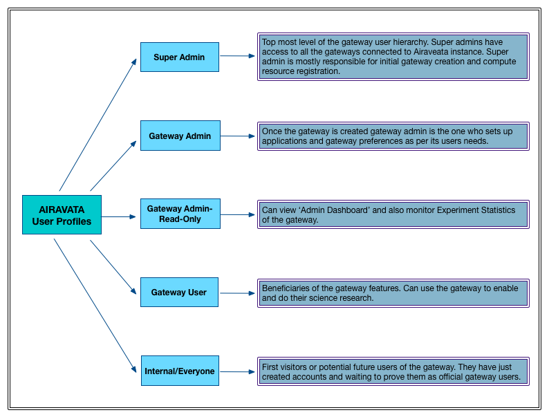

### Airavata User Profiles

#### What Are Airavata User Profiles?

1. When using Airavata as the middleware between your gateway and computational resources first identify and understand the user profiles available and their potential.
2. Knowling the profiles and the features of each will assist on shaping your gateway user hierarchy.
3. There are 5 active user profiles in Airavata and which features available differes from one another.
4. 'Image - Airavata User Profiles' depicts the features available for each profile.
Image - Airavata User Profiles

#### What each user Profile can do within PGA?

- Super Admin
	- Super admins has access to all the gateways as well as to Airavata and PGA. Currently this role resides with limited members of SGG group at IU.
	- Create Gateway and set up identity server for user account management. 
	- Register Computer resource available to submit jobs through Airavata
	- Add email monitoring accounts detail to Airavata for each gateway
	- Gateway Credential store token set up for secure communication
	- Can monitor all the resources and applications across all the gateways connecting to Airavata platform/SciGaP
			
- Gateway Admin	
	- Set up gateway preferences for compute resource and data management
	- Can Cancel, clone experiments of a gateway user through Admin dashboard
	- Ability to enable disable applications within gateway
	- Can create gateway specific compute resources for job submission
	- Can Cancel, clone experiments of a gateway user through Admin dashboard
		
- Gateway Admin-Read-Only
	- Biggest feature for read-only admins is the ability to monitor experiments through Experiments Statistics in Admin dashboard. They also can edit, cancel and clone an experiment belonging to a gateway user.
		
- Gateway User
	- Request new features, applications via gateway
	- Report bug, issue to the gateway admin
	- Password recovery
		

