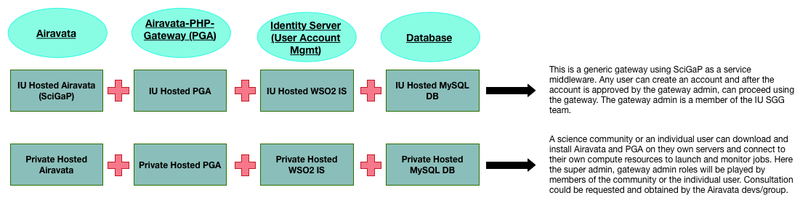

# Airavata Is....

Apache Airavata is a distributed framework that supports execution and management of computational scientific applications and workflows in grid based systems, remote clusters and cloud based systems. 
Airavata’s main focus is on submitting and managing application executions and workflows in grid based systems. 
Airavata’s architecture is extensible to support for other underlying resources as well. 
Traditional scientific applications provide a portal for users to submit and manage scientific applications which is called as science gateways. 
Airavata can be used by scientific gateway developers as their middleware layer. They can directly call airavata API in order to communicate with grid based system. 

# How do you want to use Airavata?

There are multiple ways you could use Airavata and its gateway; PGA. 
Based on the option you select the level of assistance you receive from Airavata group will differ. 
They will always act as the consultants to science communities and users who are looking out for middleware and gateways.
Image - Multiple Options for Using Airavata